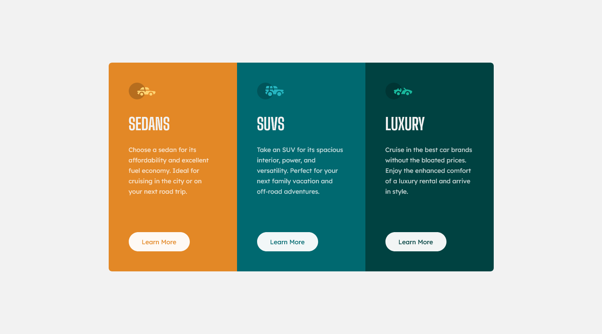

# Frontend Mentor - 3-column preview card component solution

This is a solution to the [3-column preview card component challenge on Frontend Mentor](https://www.frontendmentor.io/challenges/3column-preview-card-component-pH92eAR2-). Frontend Mentor challenges help you improve your coding skills by building realistic projects.

## Table of contents

- [Overview](#overview)
  - [Screenshot](#screenshot)
  - [Links](#links)
- [My process](#my-process)
  - [Built with](#built-with)
  - [What I learned](#what-i-learned)
- [Author](#author)

## Overview

### Screenshot

### Links

- Solution URL: <https://github.com/codepalacios/3-column-preview-card-component>
- Live Site URL: <https://codepalacios.github.io/3-column-preview-card-component/>

## My process

### Built with

- Semantic HTML5 markup
- CSS custom properties
- Flexbox
- Mobile-first workflow

### What I learned

I learned how to create a responsive design using the rem unit of measure.

## Author

- GitHub - [@codepalacios](https://github.com/codepalacios)
- Frontend Mentor - [@codepalacios](https://www.frontendmentor.io/profile/codepalacios)
